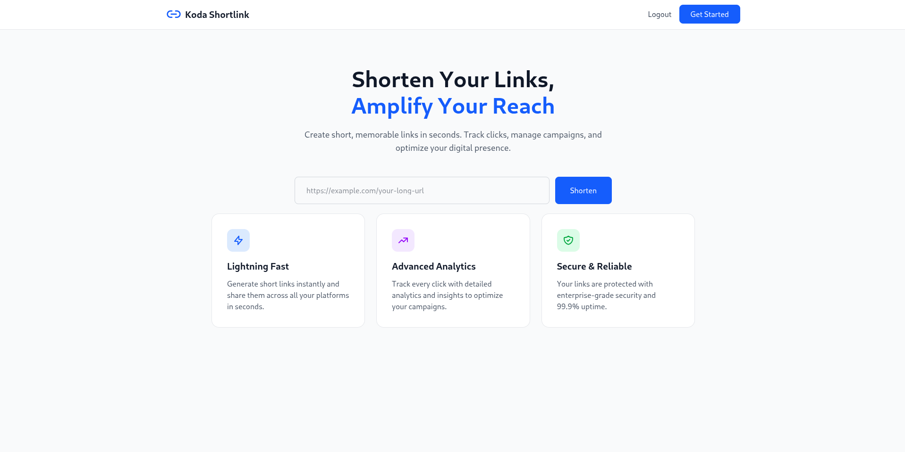
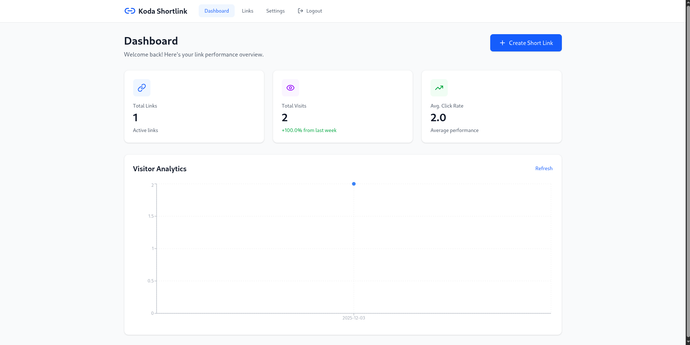
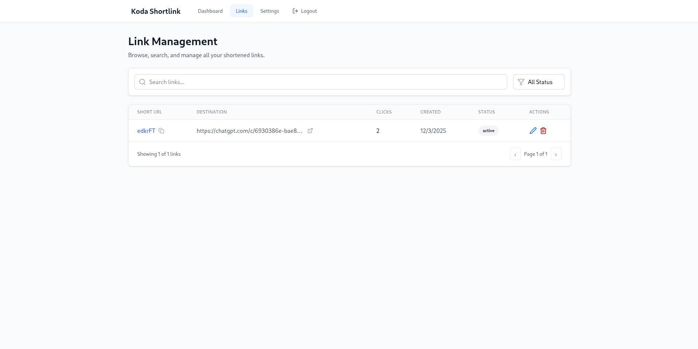
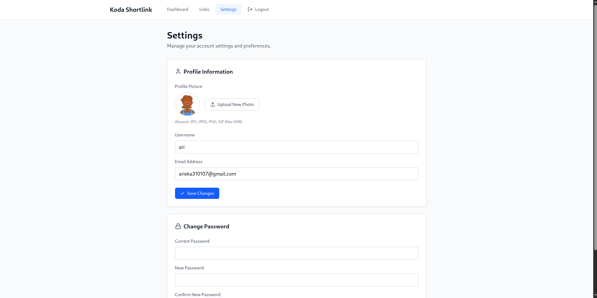

# Frontend - Shortlink Service

A modern, responsive URL shortening service frontend built with React, Vite, and Tailwind CSS.

## Tech Stack

- **React**: 18.x
- **Vite**: Latest version
- **Build Tool**: Vite
- **Styling**: Tailwind CSS (assumed from common setup)
- **State Management**: React Hooks
- **HTTP Client**: Axios/Fetch API

## Project Structure

```
finalfe/
├── node_modules/        # Dependencies
├── public/              # Static assets
├── src/                 # Source files
│   └── pages/           # Page components
│       ├── auth/        # Authentication pages
│       ├── dashboard/   # Dashboard page
│       └── home/        # Home page
├── .env                 # Environment variables
├── .gitignore
├── App.jsx              # Main App component
├── index.css            # Global styles
├── index.html           # HTML entry point
├── main.jsx             # Application entry point
├── Dockerfile           # Docker configuration
├── eslint.config.js     # ESLint configuration
├── nginx.conf           # Nginx configuration
├── package.json         # Dependencies & scripts
├── package-lock.json    # Dependency lock file
├── README.md            # This file
└── vite.config.js       # Vite configuration
```

## Prerequisites

- Node.js 16.x or higher
- npm or yarn
- Backend API running (see backend README)

## Environment Variables

Create a `.env` file in the root directory:

```env
# API Configuration
VITE_BASE_URL=http://localhost:8080
```

## Installation

1. **Clone the repository**
   ```bash
   git clone <repository-url>
   cd finalfe
   ```

2. **Install dependencies**
   ```bash
   npm install
   # or
   yarn install
   ```

3. **Set up environment variables**
   ```bash
   cp .env.example .env
   # Edit .env with your configuration
   ```

## Running the Application

### Development Mode

```bash
npm run dev
# or
yarn dev
```

The application will be available at `http://localhost:5173`

### Build for Production

```bash
npm run build
# or
yarn build
```

Build output will be in the `dist/` directory.

### Preview Production Build

```bash
npm run preview
# or
yarn preview
```

### Using Docker

```bash
# Build Docker image
docker build -t shortlink-frontend .

# Run container
docker run -p 80:80 shortlink-frontend

# Using Docker Compose
docker-compose up -d
```

## Application Features

### 🏠 Home Page
- View all public shortlinks
- Quick search and filter
- Click to copy short URLs
- View shortlink statistics

### 🔐 Authentication
- User registration with email validation
- Secure login with JWT
- Password recovery (if implemented)
- Session management

### 📊 Dashboard
- Personal shortlink management
- Create new shortlinks with custom codes
- Edit and delete existing shortlinks
- View click analytics and statistics
- Profile management
- Upload profile picture

### 🔗 Shortlink Features
- Generate random short codes
- Create custom short codes
- Set expiration dates
- Track click statistics
- QR code generation (if implemented)

## Page Routes

```
/                    # Home page
/auth                # Authentication page (login/register)
/dashboard           # User dashboard (protected)
/:shortCode          # Redirect to original URL
```

## Component Structure

```
src/
├── components/          # Reusable components
│   ├── Header.jsx
│   ├── Footer.jsx
│   ├── LinkCard.jsx
│   └── ...
├── pages/
│   ├── auth/           # Auth pages
│   ├── dashboard/      # Dashboard pages
│   └── home/           # Home pages
├── hooks/              # Custom React hooks
├── utils/              # Utility functions
├── services/           # API services
└── contexts/           # React contexts
```

## API Integration

The frontend communicates with the backend API:

```javascript
// Example API call
import axios from 'axios';

const api = axios.create({
  baseURL: import.meta.env.VITE_API_URL,
  headers: {
    'Content-Type': 'application/json',
  },
});

// Add token to requests
api.interceptors.request.use((config) => {
  const token = localStorage.getItem('token');
  if (token) {
    config.headers.Authorization = `Bearer ${token}`;
  }
  return config;
});
```

## Available Scripts

```json
{
  "dev": "vite",                    // Start development server
  "build": "vite build",            // Build for production
  "preview": "vite preview",        // Preview production build
  "lint": "eslint . --ext js,jsx",  // Run ESLint
  "format": "prettier --write ."    // Format code
}
```

## Styling

The project uses Tailwind CSS for styling. Configuration can be found in `tailwind.config.js`.

### Common Utility Classes

```jsx
// Button example
<button className="bg-blue-500 hover:bg-blue-700 text-white font-bold py-2 px-4 rounded">
  Create Shortlink
</button>

// Card example
<div className="bg-white shadow-md rounded-lg p-6">
  {/* Card content */}
</div>
```

## State Management

The application uses React hooks for state management:

- `useState` - Component state
- `useEffect` - Side effects
- `useContext` - Global state (auth, theme)
- `useReducer` - Complex state logic

## Authentication Flow

1. User logs in via `/auth` page
2. Backend returns JWT token
3. Token stored in localStorage
4. Token included in API requests
5. Protected routes check for valid token

```javascript
// Protected route example
const ProtectedRoute = ({ children }) => {
  const token = localStorage.getItem('token');
  
  if (!token) {
    return <Navigate to="/auth" />;
  }
  
  return children;
};
```

## Testing

```bash
# Run unit tests (if configured)
npm run test

# Run e2e tests (if configured)
npm run test:e2e

# Run tests with coverage
npm run test:coverage
```

## Building for Production

1. **Build the application**
   ```bash
   npm run build
   ```

2. **Optimize assets**
   - Images are automatically optimized
   - JavaScript is minified and bundled
   - CSS is extracted and minified

3. **Deploy**
   - Upload `dist/` folder to your hosting service
   - Configure environment variables on hosting platform
   - Set up SSL certificate
   - Configure domain and DNS

## Deployment Options

### Netlify
```bash
npm run build
# Deploy dist/ folder
```

### Vercel
```bash
vercel --prod
```

### Nginx (using Docker)
The included Dockerfile uses Nginx to serve the static files.

### GitHub Pages
```bash
npm run build
# Deploy dist/ folder to gh-pages branch
```

## Performance Optimization

- Code splitting with dynamic imports
- Lazy loading of routes and components
- Image optimization
- Caching strategies
- Minimized bundle size

## Browser Support

- Chrome (latest)
- Firefox (latest)
- Safari (latest)
- Edge (latest)

## Troubleshooting

### Common Issues

**Issue: API connection failed**
```bash
# Check if backend is running
curl http://localhost:8080/health

# Verify VITE_API_URL in .env
```

**Issue: Build fails**
```bash
# Clear cache and reinstall
rm -rf node_modules package-lock.json
npm install
```

**Issue: Styles not loading**
```bash
# Rebuild Tailwind
npm run build
```

## Contributing

1. Fork the repository
2. Create a feature branch (`git checkout -b feature/amazing-feature`)
3. Commit your changes (`git commit -m 'Add some amazing feature'`)
4. Push to the branch (`git push origin feature/amazing-feature`)
5. Open a Pull Request

## Code Style

- Follow ESLint configuration
- Use Prettier for formatting
- Follow React best practices
- Write meaningful component and variable names

## License

This project is licensed under the MIT License.

## Screenshots

### Home Page


### Dashboard




### Authentication


